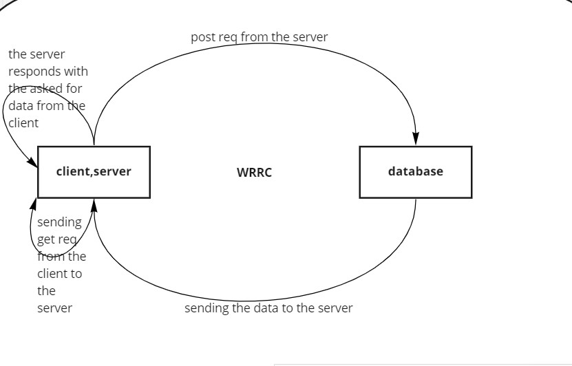
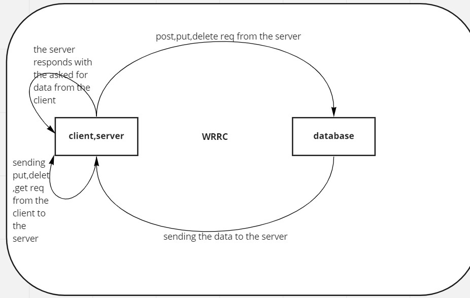

# Movies-Library
Movies Repo 
# Project Name - Project Version

**Author Name**: Ibrahim Alaqoul.

## WRRC

## Overview
Movie Application that  you'll find Every intresting movie in it.
## Getting Started
For the first step i called the express framework , and i did declared the express as a func. in a constant called myapp. then i did the command listen to make sure it's alive.For the endpoints i did use get command wich take two params the first is the path and the second is the function i will call to send the data .
for today it was different like we have to get data from API , it was super easy as long as i understand how i deal with data from the API.
leant how to decument any Online API.
Today we did post req to the database we built and did get the data from the local rever as it is the same the client.
for the last day of database we used put and delete where put updates some specific data from database and delete to delete data from the database.
## Project Features
Movies app to search for any intersting movie or tv show you look in.
